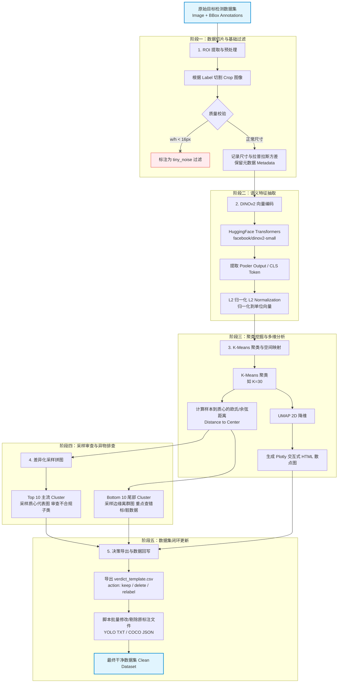

```mermaid
graph TD
    %% 输入节点
    A[原始目标检测数据集<br/>Image + BBox Annotations] --> B[1. ROI 提取与预处理]

    %% 步骤1: 预处理与清洗
    subgraph S1[阶段一：数据切片与基础过滤]
        B --> B1[根据 Label 切割 Crop 图像]
        B1 --> B2{质量校验}
        B2 -- w/h < 16px --x B3[标注为 tiny_noise 过滤]
        B2 -- 正常尺寸 --> B4[记录尺寸与拉普拉斯方差<br/>保留元数据 Metadata]
    end

    %% 步骤2: 特征提取
    subgraph S2[阶段二：语义特征抽取]
        B4 --> C[2. DINOv2 向量编码]
        C --> C1[HuggingFace Transformers<br/>facebook/dinov2-small]
        C1 --> C2[提取 Pooler Output / CLS Token]
        C2 --> C3[L2 归一化 L2 Normalization<br/>归一化到单位向量]
    end

    %% 步骤3: 聚类与分析
    subgraph S3[阶段三：聚类挖掘与多维分析]
        C3 --> D[3. K-Means 聚类与空间映射]
        D --> D1[K-Means 聚类<br/>如 K=30]
        D1 --> D2[计算样本到质心的欧氏/余弦距离<br/>Distance to Center]
        D1 --> D3[UMAP 2D 降维]
        D3 --> D4[生成 Plotly 交互式 HTML 散点图]
    end

    %% 步骤4: 可视化与审查
    subgraph S4[阶段四：采样审查与异物排查]
        D2 --> E[4. 差异化采样拼图]
        E --> E1[Top 10 主流 Cluster<br/>采样质心代表图 审查不合规子类]
        E2[Bottom 10 尾部 Cluster<br/>采样边缘离群图 重点查错标/脏数据]
        D2 --> E2
    end

    %% 步骤5: 闭环回写
    subgraph S5[阶段五：数据集闭环更新]
        E1 --> F[5. 决策导出与数据回写]
        E2 --> F
        D4 --> F
        F --> F1[导出 verdict_template.csv<br/>action: keep / delete / relabel]
        F1 --> F2[脚本批量修改/剔除原标注文件<br/>YOLO TXT / COCO JSON]
        F2 --> G[最终干净数据集 Clean Dataset]
    end

    %% 样式配置
    classDef primary fill:#e1f5fe,stroke:#0288d1,stroke-width:2px;
    classDef stage fill:#fafafa,stroke:#bdbdbd,stroke-width:1px,stroke-dasharray: 5 5;
    classDef error fill:#ffebee,stroke:#e53935,stroke-width:1px;
    
    class A,G primary;
    class B3 error;
```